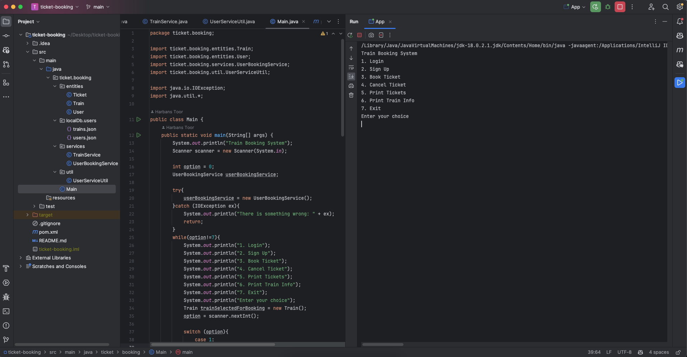
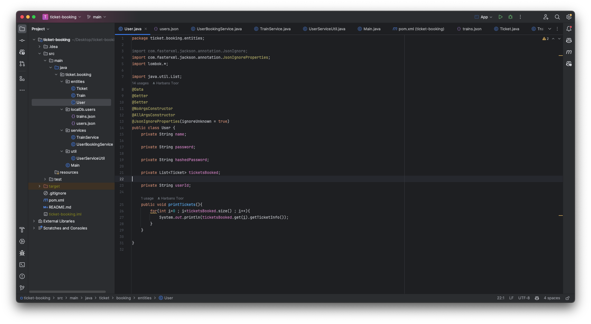
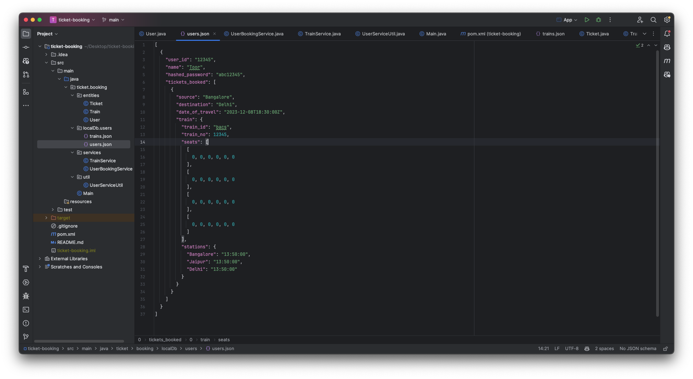
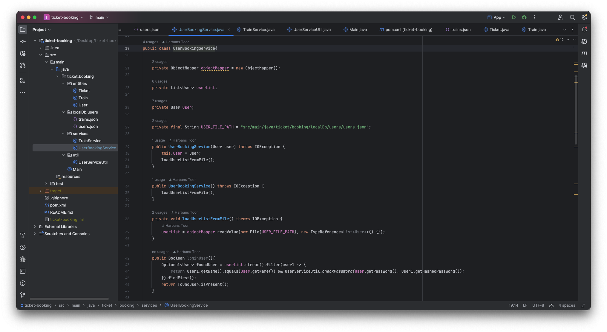
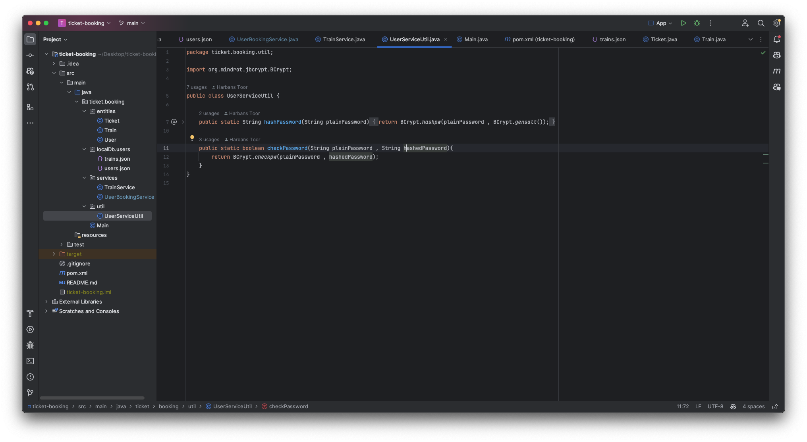

# Ticket Booking Backend Application

This Java-based ticket booking backend application provides robust functionality for managing user accounts, train information, and ticket bookings. The application utilizes modern Java features, an in-memory database using JSON files, and secure password hashing with bcrypt.



## Features

- **Java Language:** The application is developed primarily in Java, leveraging its versatility and extensive ecosystem.

- **Entities:** Entities for [User](src/main/java/ticket/booking/entities/User.java), [Train](src/main/java/ticket/booking/entities/Train.java)
,and [Ticket](src/main/java/ticket/booking/entities/Ticket.java) have been meticulously designed to handle user data, train information, and ticket bookings efficiently.



- **In-Memory Database:** Utilizing JSON files as a [localDb](src/main/java/ticket/booking/localDb/users/users.json), the application efficiently stores and retrieves user and train data without the need for an external database. 



- **Services:** [User Service](src/main/java/ticket/booking/services/UserBookingService.java) and [Train Service](src/main/java/ticket/booking/services/TrainService.java)
are implemented to handle user signup, login authentication, and user-related operations such as booking tickets, fetching bookings, and canceling bookings.



- **Password Hashing:** Bcrypt is employed in [UserServiceUtil](src/main/java/ticket/booking/util/UserServiceUtil.java) to securely hash user passwords, ensuring the confidentiality and integrity of user credentials.



- **Modern Java Features:** The project leverages various modern Java features such as `ObjectMapper`, `Stream`, and `Filter`, enhancing code readability, maintainability, and performance.

- **Lombok Dependency:** Lombok, a convenient Java library, is used to reduce boilerplate code and improve code conciseness and productivity.

## Importing and Running The Project Through IntelliJ IDEA

1. **Clone the Repository:**
   Open a terminal or command prompt and navigate to the directory where you want to clone the project.
   Run the following command to clone the repository:
   ```
   git clone https://github.com/harbanssinghtoor/ticket-booking-backend-application.git
   ```

2. **Open IntelliJ IDEA:**
   Open IntelliJ IDEA on your local machine.

3. **Open the Project:**
   Click on "Open or Import" in the IntelliJ IDEA welcome screen.
   Navigate to the directory where you cloned the "ticket-booking-backend-application" repository.
   Select the directory and click "Open" to open the project in IntelliJ IDEA.

4. **Configure JDK (if necessary):**
   If the project requires a specific JDK version, configure it in IntelliJ IDEA:
   - Go to `File` > `Project Structure`.
   - Under `Project`, select the appropriate JDK version from the dropdown menu.

5. **Import Project Dependencies:**
   If the project uses Maven or Gradle for dependency management, IntelliJ IDEA will automatically import the dependencies when you open the project.

6. **Run the Application:**
   Find the [Main](src/main/java/ticket/booking/Main.java) class of the application.
   Right-click on the main class file and select "Run" from the context menu.
   Alternatively, you can configure a run configuration:
   - Click on `Run` > `Edit Configurations`.
   - Click on the `+` icon and select `Application`.
   - Configure the main class and any necessary program arguments.
   - Click `OK` to save the configuration.
   - Click the green "Run" button in the toolbar to run the application.

## Contributing

Contributions are welcome! If you'd like to contribute to the project, feel free to fork the repository, make your changes, and submit a pull request.

## License

This project is licensed under the , allowing for open collaboration and usage.